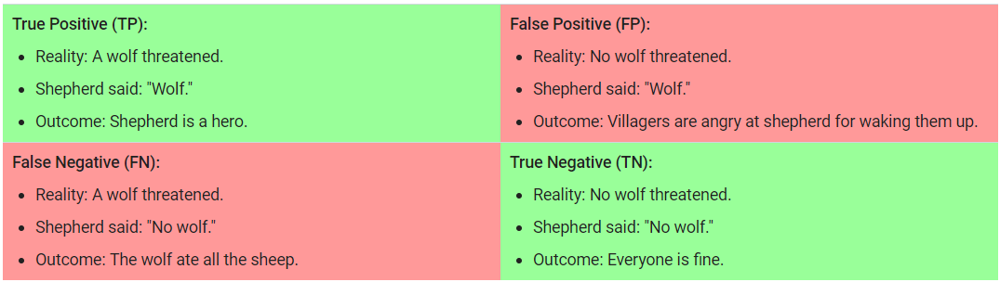

# Chapter 11
## Classification
###Threshold
In order to map a logistic regression value to a binary category, you must define a `classification threshold` (also called the decision threshold)

###Metrics

A true positive is an outcome where the model correctly predicts the positive class. Similarly, a true negative is an outcome where the model correctly predicts the negative class.

A false positive is an outcome where the model incorrectly predicts the positive class. And a false negative is an outcome where the model incorrectly predicts the negative class

